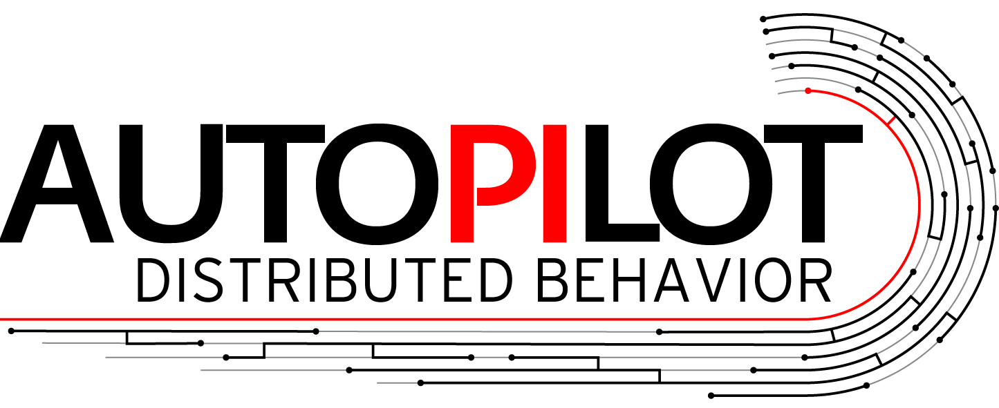
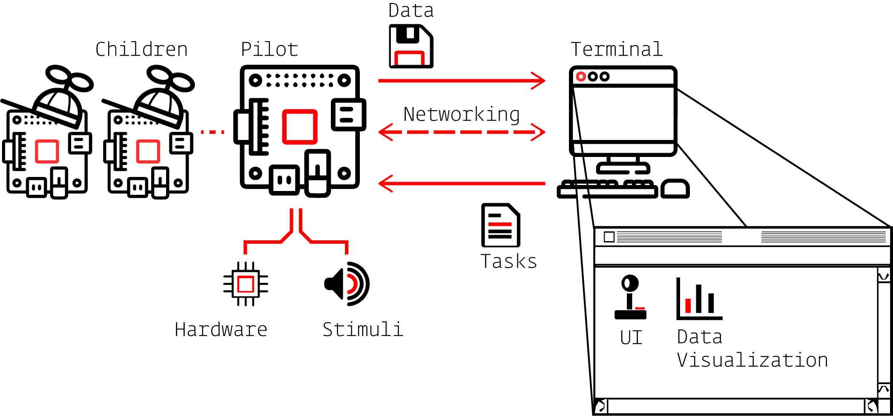
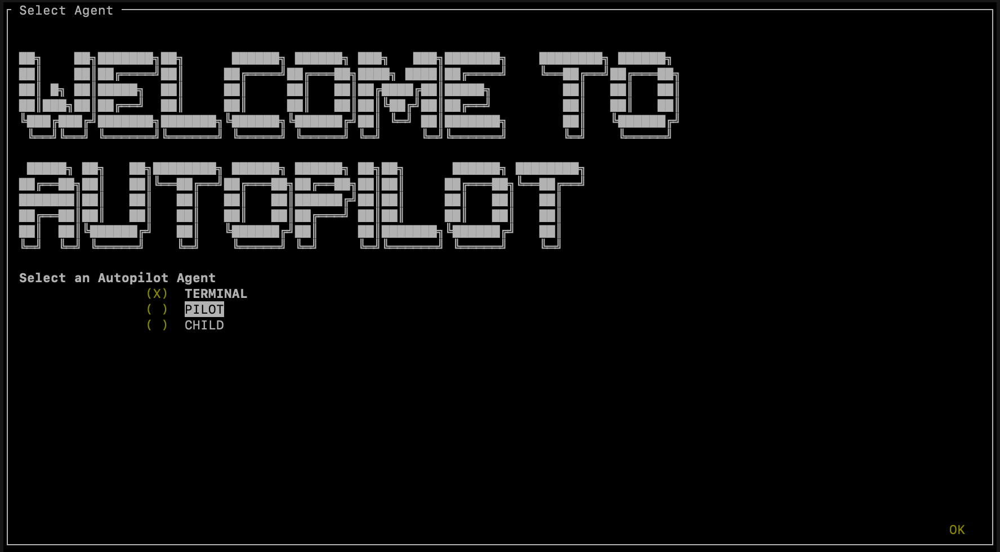

[](https://pypi.org/project/auto-pi-lot/)

[](https://opensource.org/licenses/MPL-2.0)
[](code_of_conduct.md) 
[](https://twitter.com/auto_pi_lot)


Status:

[](https://docs.auto-pi-lot.com/en/latest/?badge=latest)
[](https://app.travis-ci.com/github/auto-pi-lot/autopilot/branches)
[](https://coveralls.io/github/auto-pi-lot/autopilot?branch=main)


# Maintenance Mode

*2024-01-22* 

Autopilot is in *maintenance-only mode* - development has been paused as we take the long way around towards
building a new kind of p2p networking module to support a reworked autopilot 2.0. We will write a more
detailed blogpost about lessons learned from autopilot soon. 

Autopilot is not dead, it is merely resting <3

-jonny

# Autopilot



| [Docs](https://docs.auto-pi-lot.com) | [Paper](https://www.biorxiv.org/content/10.1101/807693v1) | [Forum](https://github.com/auto-pi-lot/autopilot/discussions) | [Wiki](https://wiki.auto-pi-lot.com) |
| :-: | :-: | :-: | :-: |
| [](https://docs.auto-pi-lot.com) | [](https://www.biorxiv.org/content/10.1101/807693v1)  | [](https://github.com/auto-pi-lot/autopilot/discussions) | [](https://wiki.auto-pi-lot.com)

Autopilot is a Python framework for performing complex, hardware-intensive behavioral experiments with swarms of networked Raspberry Pis. 
As a tool, it provides researchers with a toolkit of flexible modules to design experiments without rigid programming & API limitations. 
As a vision, it dreams of bridging the chaotic hacky creativity of scientific programmers with a standardized, 
communally developed library of reproducible experiment prototypes.

Autopilot was developed with three primary design principles:

* **Flexibility** - Autopilot was designed for any hardware and any experiment -- 
  its hardware API is designed to give a structured wrapper around the code you already use, and its task design is
  entirely non-prescriptive. It attempts to eliminate the need for researchers to use a patchwork of mutually incompatible tools to perform complex
  experiments. Autopilot is a hacker's plaything -- rather than a uniform, simplified experience,
  its modular design and complete API-level documentation is meant to encourage users to make and break core Autopilot modules.
* **Efficiency** - Autopilot uses Python as a glue around high-performance, low-level libraries,
  and is fully concurrent across multiple threads, processes, and computers. Its distributed
  design eliminates the hard limits faced by by single-computer
  systems, letting researchers use arbitrary numbers and combinations of hardware components
  to perform complex, hardware-intensive experiments at scale.
* **Reproducibility** - Autopilot obsessively documents data provenance,
  logging the entire history of an Animal's training, including any version and local
  code changes. Any part of an experiment that isn't documented is considered a bug. By integrating experiments and producing data that is
  clean at the time of acquisition, Autopilot makes it easy to do good science -- its goal is to allow
  exact experimental replication from a single file. 
  

# Distributed Behavior

Autopilot's premise is simple: to scale experiments, *just use more computers*.

Autopilot systems consist of multiple "Agents" -- computers with specialized roles in the swarm.
One user-facing "Terminal" agent allows a researcher to control many "Pilots," or computers that perform experiments (typically the beloved Raspberry Pi).
Each Pilot can coordinate one or many "Children" to offload subsets of an experiment's computational or hardware requirements.
Users can use and misuse Autopilot's flexible modules to make whatever agent topology they need <3. 



# Module Overview

Autopilot divides the logical structure of experiments into independent<sup>1</sup> modules:

| | Module |
| :-: | --- |
|  | **Agents - [Pilot](https://docs.auto-pi-lot.com/en/latest/autopilot.core.pilot.html) & [Terminal](https://docs.auto-pi-lot.com/en/latest/autopilot.core.terminal.html)** Runtime classes that encapsulate a computer/Pi's role in the swarm. Terminals provide the user interface and coordinate subjects and tasks, Pilots do the experiments. Formalizing the Agent API to allow additional agents like Compute or Surveillance agents is a major short-term development goal! |
|  | **[Hardware](https://docs.auto-pi-lot.com/en/latest/autopilot.hardware.html)** - Control your tools! Extensible classes to control whatever hardware you've got. |
|  | **[Stimuli](https://docs.auto-pi-lot.com/en/latest/autopilot.stim.html)** - Stimulus management and presentation. Parametric sound generation with a realtime audio server built on Jackd. Stubs are present for future development of visual stimuli using Psychopy. |
|  | **[Tasks](https://docs.auto-pi-lot.com/en/latest/autopilot.tasks.html)** - Build experiments! Write some basic metadata to describe data, plots, and hardware and the rest is up to you :)  |
|  | **[Subject](https://docs.auto-pi-lot.com/en/latest/autopilot.core.subject.html)** - Data management with hdf5 and pyTables. Abstraction layer for keeping obsessive records of subject history and system configuration |
|  | **[Transforms](https://docs.auto-pi-lot.com/en/latest/autopilot.transform.html)** - Composable data transformations. Need to control the pitch of a sound with a video? build a transformation pipeline to connect your objects |
|  | **[UI](https://docs.auto-pi-lot.com/en/latest/autopilot.core.gui.html)** - UI for controlling swarms of Pilots using Qt5/PySide2 |
|  | **[Visualization](https://docs.auto-pi-lot.com/en/latest/autopilot.viz.html)** - (Mostly Prototypes) to do common visualizations |


<sup>1</sup> a continual work in progress!
# Getting Started

[**All documentation is hosted at https://docs.auto-pi-lot.com**](https://docs.auto-pi-lot.com)

Installation is simple, just install with pip and use Autopilot's guided setup to configure your environment and preferences.
The initial setup routine uses a CLI interface that is SSH friendly :)

```bash
pip3 install auto-pi-lot
python3 -m autopilot.setup.setup
```



All of Autopilot is quite new, so bugs, incomplete documentation, missing features are very much expected! Don't be shy about
[raising issues](https://github.com/auto-pi-lot/autopilot/issues) or [asking questions in the forum](https://github.com/auto-pi-lot/autopilot/discussions).


# Development Status

Jonny is trying to graduate! Autopilot will be slow and maybe a little chaotic until then!

## Branch Map

We're working on a formal contribution system, pardon the mess! Until we get that and our CI coverage up, `main` will lag a bit behind the development branches:

* [`dev`](https://github.com/auto-pi-lot/autopilot/tree/dev) - main development branch that collects hotfixes, PRs, etc. Unstable but usually has lots of extra goodies
* [`hotfix`](https://github.com/auto-pi-lot/autopilot/tree/hotfix) - branches from `dev` for building and testing hotfixes, PRs back to `dev`.
* [`lab`](https://github.com/auto-pi-lot/autopilot/tree/lab) - branches from `dev` but doesn't necessarily PR back, the local branch used in the maintaining ([Wehr](http://uoneuro.uoregon.edu/wehr/)) lab
* [`parallax`](https://github.com/auto-pi-lot/autopilot/tree/parallax) - experimental departure from `dev` to implement a particular experiment and rebuild a lot of components along the way, will eventually return to `dev` <3

## Short-Term

See the short-term development goals in our version milestones:

* [`v0.4.0`](https://github.com/auto-pi-lot/autopilot/milestone/1) - Implement registries to separate user code extensions like tasks and local hardware devices in a user directory, preserve source code in produced data so local development isn't lost. 
* [`v0.5.0`](https://github.com/auto-pi-lot/autopilot/milestone/2) - Make a unitary inheritance structure from a root Autopilot object such that a) common operations like logging and networking are implemented only once, b) the plugin system for `v0.4.0` can not only add new objects, but replace core objects while maintaining provenance (ie. no monkey patching needed), c) object behavior that requires coordination across multiple instances gets much easier, making some magical things like self-healing self-discovering networking possible. This will also include a major refactoring of the code structure, finally breaking up some of the truly monstrous thousand-line modules in `core` into an actually modular system we can build from <3

## Long-Term

Autopilot's extended development goals, in their full extravagance, can be found at the [Autopilot Development Todo](https://docs.auto-pi-lot.com/en/latest/todo.html)

# What's new?

**[v0.3.0](https://docs.auto-pi-lot.com/en/latest/changelog/v0.3.0.html#changelog-v030)**

After much ado, we're releasing Autopilot's first major upgrade. Cameras, Continuous data, DeepLabCut, and a lot more!

- Autopilot has moved to Python 3!! (Tested on 3.6-3.8)
- Capturing video with OpenCV and the Spinnaker SDK is now supported (See autopilot.hardware.cameras)
- An I2C_9DOF motion sensor and the MLX90640 temperature sensor are now supported.
- Timestamps from GPIO events are now microsecond-precise thanks to some modifications to the pigpio library
- GPIO output timing is also microsecond-precise thanks to the use of pigpio scripts, so you can deliver exactly the reward volumes you intend <3
- Hardware modules have been refactored into their own module, and have been almost wholly rebuilt to have sensible inheritance structure.
- Networking modules are more efficient and automatically compress arrays (like video frames!) on transmission. Streaming is also easier now, check out Net_Node.get_stream() !
- We now have a detailed development roadmap , so you can see the magnificent future we have planned.
- We have created the autopilot-users discussion board for troubleshooting & coordinating community development :)


# Supported Systems

**OS**

- Ubuntu >=16.04
- raspiOS >=Buster

**Python Versions**

- 3.7
- 3.8
- 3.9

**Raspberry Pi Versions**

- Raspi>=3b (Raspi 4 strongly recommended!)
