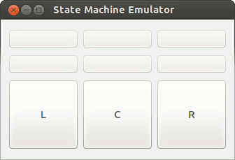
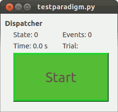

.. highlight:: python

Getting started with TASKontrol
===============================

This document explains how to run an simple paradigm using TASKontrol. We will start by running paradigms using the emulator before we try anything with external interfaces.

1. First, you need to `download and install TASKontrol`_.
2. Make sure that in your ``settings/settings.py`` file, you have set ``STATE_MACHINE_TYPE = 'emulator'``.
3. Open your favorite editor and save the following Python code into a file (any folder would work). Let's assume you called the file ``testparadigm.py``.

.. code-block:: python
    :linenos:

    from taskontrol.plugins import templates

    class Paradigm(templates.ParadigmMinimal):
        def __init__(self,parent=None):
            super(Paradigm, self).__init__(parent)

    if __name__ == "__main__":
        (app,paradigm) = templates.paramgui.create_app(Paradigm)

4. In a terminal, go to the folder where you saved the file, and open the paradigm by running the command: ``python testparadigm.py``

Interacting with the paradigm
-----------------------------

* The command above should open two windows: one with a big "**Start**" button, and one emulator window with multiple buttons.
* When you press the "**Start**" button, the paradigm will run and you will see the time counter increase.
* Pressing buttons in the emulator window will make the "Events" counter in the paradigm window increase, but nothing else should happen.

What is the code doing?
-----------------------

* **Line 1** imports a module that contains paradigm templates. This module will in turn import all necessary modules from PySide (such as QtGui for graphical interface) and taskontrol (rigsettings, dispatchers, etc for defining the logic of the paradigm).
* **Line 3** is the class definition of our paradigm, which we call ``Paradigm``, which will be a subclass of the simplest template called ``ParadigmMinimal``.
* **Line 4-5** are part of the constructor of the class. These lines will appear in any paradigm we create.
* **Line 7** is a standard Python way of checking if the file is run as a whole (as opposed to imported by another file).
* **Line 8** will call the ``create_app()`` method, which will return:

  * An instance of the ``QtGui.QApplication`` class (the main class for running Qt applications).
  * An instance of our ``Paradigm`` class (which gives us access to everything inside our paradigm).

..
 * Line 1 imports a module that contains paradigm templates. This module will in turn import all necessary modules from PySide (QtCore and QtGui) and taskontrol (rigsettings, statematrix, etc).
 * Lines 3-5 create the class Paradigm(), where we will define all details of the task.
 * Lines 7-8 create an instance of the class Paradigm(), set up our application, and open the main window.
 * There are two ways to run your paradigm: (1) from the console, or (2) from ipython. To run from the console, simple type:
  python testparadigm.py
 * State #0 (named 'ready_next_trial' by default) will be the last state of each trial. When reached, the state machine will yield control to the program running the user interface to prepare the next trial. Once done, the method dispatcher.ready_to_start_trial() will trigger a jump to State #1 to get the trial started (and give control back to the state machine).

.. _download and install TASKontrol: https://github.com/sjara/taskontrol/blob/master/INSTALL.md
