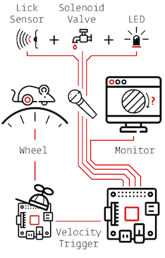

Distributed Go/No-Go
=========================================

.. note::

    This example was written for a very early version of Autopilot, v0.1.0, and much has changed since then!

    This example is being preserved as an example of some basic approaches to networked behavior problems,
    as much of that is still useful, even if the precise syntax of how to use Autopilot has changed.

To demonstrate the use of Child agents, we'll build the distributed Go/No-Go task described in section 4.3 of the Autopilot whitepaper.

In short, a subject runs on a circular running wheel whose velocity is measured by a laser computer mouse.
When the subject 'fixates' by slowing below a threshold velocity, an drifting Gabor grating is presented.
If the grating changes angles, the subject is rewarded if they lick in an IR beambreak sensor.
If the grating doesn't change angles, the subject is rewarded if they refrain from licking until the stimulus has ended.

Additional Prefs
----------------

To use a Child with this task, we will need to have a second Raspberry Pi setup with the same routine as a Pilot, except it needs the following values in its ``prefs.json`` file:

**Child Prefs**

.. code-block:: json

    {
        "NAME" : "wheel_child",
        "LINEAGE" : "CHILD",
        "PARENTID" : "parent_pilot",
        "PARENTIP" : "ip.of.parent.pilot",
        "PARENTPORT": "<MSGPORT of parent>",
    }

And the parent pilot needs to have

**Parent Prefs**

.. code-block:: json

    {
        "NAME": "parent_pilot",
        "CHILDID": "wheel_child",
        "LINEAGE": "PARENT"
    }

Go/No-Go Parameterization
-------------------------

The parameterization for this task is similar to that of the Nafc task above with a few extensions...

.. code-block:: python

    from autopilot.tasks import Task

    class GoNoGo(Task):

        # Task parameterization
        PARAMS = odict()
        PARAMS['reward'] = {'tag': 'Reward Duration (ms)',
                            'type': 'int'}
        PARAMS['timeout']        = {'tag':'Delay Timeout (ms)',
                                    'type':'int'}
        PARAMS['stim'] = {'tag':  'Visuals',
                          'type': 'visuals'}

        # Plot parameterization
        PLOT = {
            'data': {
                'x': 'shaded',
                'target': 'point',
                'response': 'segment'
            },
            # our plot will use time as its x-axis rather than the trial number
            'continuous': True
        }

        # TrialData descriptor
        class TrialData(tables.IsDescription):
            trial_num    = tables.Int32Col()
            target       = tables.BoolCol()
            response     = tables.StringCol(1)
            correct      = tables.Int32Col()
            RQ_timestamp = tables.StringCol(26)
            DC_timestamp = tables.StringCol(26)
            shift        = tables.Float32Col()
            angle        = tables.Float32Col()
            delay        = tables.Float32Col()

We add one additional data descriptor that describes the continuous data that will be sent from the :class:`~autopilot.core.hardware.Wheel` object:

.. code-block:: python

        class ContinuousData(tables.IsDescription):
            x = tables.Float64Col()
            y = tables.Float64Col()
            t = tables.Float64Col()

The hardware specification is also similar, with one additional :class:`~autopilot.core.hardware.Flag` object which
behaves identically to the :class:`~autopilot.core.hardware.Beambreak` object with reversed logic (triggered by 0->1 rather than 1->0).

.. code-block:: python

        HARDWARE = {
            'POKES': {
                'C': hardware.Beambreak,
            },
            'LEDS': {
                'C': hardware.LED_RGB,
            },
            'PORTS': {
                'C': hardware.Solenoid,
            },
            'FLAGS': {
                'F': hardware.Flag
            }
        }

Finally, we add an additional ``CHILDREN`` dictionary to specify the type of Child
that we need to run the task, as well as any additional parameters needed to configure it.

The ``task_type`` must refer to some key in the :data:`autopilot.tasks.CHILDREN_LIST`.

.. note::

    The ``Child`` agent is a subconfiguration of the ``Pilot`` agent, they will be delineated more
    explicitly as the agent framework is solidified.

.. code-block:: python

        CHILDREN = {
            'WHEEL': {
                'task_type': "Wheel Child",
            }
        }

Initialization
--------------

When initializing this task, we need to make our own :class:`~autopilot.core.networking.Net_Node` object
as well as initialize our child. Assuming that the child is
connected to the parent and appropriately configured (see the
additional params above), then things should go smoothly.

.. warning::

    Some of the parameters -- most egregiously the Grating stimulus -- are
    hardcoded in the initialization routine. **This is bad practice** but
    an unfortunately necessary evil because the visual stimulus infrastructure is not well developed yet.

.. code-block:: python

    from autopilot.stim.visual.visuals import Grating

    def __init__(self, stim=None, reward = 50., timeout = 1000., stage_block = None,
                 punish_dur = 500., **kwargs):
        super(GoNoGo, self).__init__()

        # we receive a stage_block from the pilot as usual, we won't use it
        # for task operation though.
        self.stage_block = stage_block
        self.trial_counter = itertools.count()

        # save parameters passed to us as arguments
        self.punish_dur = punish_dur
        self.reward = reward
        self.timeout = timeout
        self.subject = kwargs['subject']

        # init hardware and set reward as before
        self.init_hardware()
        self.set_reward(self.reward)

        # hardcoding stimulus while visual stim still immature
        self.stim = Grating(angle=0, freq=(4,0), rate=1, size=(1,1), debug=True)

        self.stages = itertools.cycle([self.request, self.discrim, self.reinforce])

**Initializing the Net Node.**

The :class:`~autopilot.core.networking.Net_Node` gets the following arguments:

* ``id``: The name that is used to identify the task's networking object so other networking objects can send it messages. We prefix the pilot's ``prefs.NAME`` with ``T_`` because it is a task, though this is not required.
* ``upstream``: The name of the network node that is directly upstream from us, we will be sending our messages to the :class:`~autopilot.agents.pilot.Pilot` that is running us -- and thus address it by its name
* ``port``: The port of our upstream mode, most commonly the ``prefs.MSGPORT``
* ``listens``: A dictionary that maps messages with different ``KEY``s to specific handling methods. Since we don't need to receive any data for this task, this is blank,
* ``instance``: Optional, denotes whether this node shouldn't be the only node that exists within the Agent -- ie. it uses the same instance of the ``tornado`` IOLoop as other nodes.

.. code-block:: python

        self.node = Net_Node(id="T_{}".format(prefs.NAME),
                             upstream=prefs.NAME,
                             port=prefs.MSGPORT,
                             listens={},
                             instance=True)

And then to initialize our Child we construct a message to send along to it.

Note that we send the message to ``prefs.NAME`` -- we don't want to have to know the IP address/etc.
for our child because it connects to us -- so the :class:`~autopilot.core.networking.Station` object handles
sending it along with its :meth:`.Pilot_Station.l_child` ``listen``.

.. code-block:: python

        # construct a message to send to the child
        value = {
            'child': {'parent': prefs.NAME, 'subject': self.subject},
            'task_type': self.CHILDREN['WHEEL']['task_type'],
            'subject': self.subject
        }

        # send to the station object with a 'CHILD' key
        self.node.send(to=prefs.NAME, key='CHILD', value=value)

The Child Task
--------------

The :class:`~autopilot.tasks.children.Wheel_Child` task is a very thin
wrapper around a :class:`~autopilot.core.hardware.Wheel` object, which does most of the work.

It creates a ``stages`` iterator with a function that returns nothing to fit in with the general task structure.

.. code-block:: python

    class Wheel_Child(object):
        STAGE_NAMES = ['collect']

        PARAMS = odict()
        PARAMS['fs'] = {'tag': 'Velocity Reporting Rate (Hz)',
                        'type': 'int'}
        PARAMS['thresh'] = {'tag': 'Distance Threshold',
                            'type': 'int'}

        HARDWARE = {
            "OUTPUT": Digital_Out,
            "WHEEL":  Wheel
        }

        def __init__(self, stage_block=None, fs=10, thresh=100, **kwargs):
            self.fs = fs
            self.thresh = thresh

            self.hardware = {}
            self.hardware['OUTPUT'] = Digital_Out(prefs.PINS['OUTPUT'])
            self.hardware['WHEEL'] = Wheel(digi_out = self.hardware['OUTPUT'],
                                           fs       = self.fs,
                                           thresh   = self.thresh,
                                           mode     = "steady")
            self.stages = cycle([self.noop])
            self.stage_block = stage_block

        def noop(self):
            # just fitting in with the task structure.
            self.stage_block.clear()
            return {}

        def end(self):
            self.hardware['WHEEL'].release()
            self.stage_block.set()

.. _wheel_guide_one:

A Very Smart Wheel
------------------

Most of the Child's contribution to the task is performed by the :class:`~autopilot.core.hardware.Wheel` object.

The Wheel accesses a USB mouse connected to the Pilot,
continuously collects its movements, and reports them back to the
Terminal with a specified frequency (``fs``) with an internal :class:`~autopilot.core.networking.Net_Node`

An abbreviated version...

.. code-block:: python

    from inputs import devices

    class Wheel(Hardware):

        def __init__(self, mouse_idx=0, fs=10, thresh=100, thresh_type='dist', start=True,
                     digi_out = False, mode='vel_total', integrate_dur=5):

            self.mouse = devices.mice[mouse_idx]
            self.fs = fs
            self.thresh = thresh
            # time between updates
            self.update_dur = 1./float(self.fs)

The Wheel has three message types,

* ``'MEASURE'`` - the main task is telling us to monitor for a threshold crossing, ie. previous trial is over and it's ready for another one.
* ``'CLEAR'`` - stop measuring for a threshold crossing event!
* ``'STOP'`` - the task is over, clear resources and shut down.

.. code-block:: python

            # initialize networking
            self.listens = {'MEASURE': self.l_measure,
                            'CLEAR'  : self.l_clear,
                            'STOP'   : self.l_stop}

            self.node = Net_Node('wheel_{}'.format(mouse_idx),
                                 upstream=prefs.NAME,
                                 port=prefs.MSGPORT,
                                 listens=self.listens,
                                 )

            # if we are being used in a child object,
            # we send our trigger via a GPIO pin
            self.digi_out = digi_out

            self.thread = None

            if start:
                self.start()

        def start(self):
            self.thread = threading.Thread(target=self._record)
            self.thread.daemon = True
            self.thread.start()

The wheel starts two threads, one that captures mouse movement events and
puts them in a queue, and another that processes movements, transmits them
to the Terminal, and handles the threshold triggers when the subject falls
below a certain velocity.

.. code-block:: python

        def _mouse(self):
            # read mouse movements and put them in a queue
            while self.quit_evt:
                events = self.mouse.read()
                self.q.put(events)

        def _record(self):

            threading.Thread(target=self._mouse).start()

            # a threading.Event is used to terminate the wheel's operation
            while not self.quit_evt.is_set():

            # ... mouse movements are collected into a 2d numpy array ...

            # if the main task has told us to measure for a velocity threshold
            # we check if our recent movements (move) trigger the threshold
            if self.measure_evt.is_set():
                do_trigger = self.check_thresh(move)
                if do_trigger:
                    self.thresh_trig()
                    self.measure_evt.clear()

            # and we report recent movements back to the Terminal
            # the recent velocities and timestamp have been calculated as
            # x_vel, y_vel, and nowtime
            self.node.send(key='CONTINUOUS',
                           value={
                               'x':x_vel,
                               'y':y_vel,
                               't':nowtime
                           })

If the threshold is triggered, a method (...``thresh_trig``...) is called that
sends a voltage pulse through the :class:`~autopilot.core.hardware.Digital_Out`
given to it by the Child task.

.. code-block:: python

        def thresh_trig(self):
            if self.digi_out:
                self.digi_out.pulse()

Go/No-Go Stage Methods
----------------------

After the child is initialized, the Parent pilot begins to call the three stage
functions for the task in a cycle

Very similar to the Nafc task above...

* ``request`` - Tell the Child to begin measuring for a velocity threshold crossing, prepare the stimulus for delivery
* ``discrim`` - Present the stimulus
* ``reinforce`` - Reward the subject if they were correct

The code here has been abbreviated for the purpose of the example:

.. code-block:: python

    def request(self):
        # Set the event lock
        self.stage_block.clear()
        # wait on any ongoing punishment stimulus
        self.punish_block.wait()

        # set triggers
        self.triggers['F'] = [
            lambda: self.stim.play('shift', self.shift )
        ]

        # tell our wheel to start measuring
        self.node.send(to=[prefs.NAME, prefs.CHILDID, 'wheel_0'],
                       key="MEASURE",
                       value={'mode':'steady',
                              'thresh':100})

        # return data from current stage
        self.current_trial = self.trial_counter.next()
        data = {
            'target': self.target, # whether to 'go' or 'not go'
            'shift': self.shift,   # how much to shift the
                                   # angle of the stimulus
            'trial_num': self.current_trial
        }

        return data

    def discrim(self):
        # if the subject licks on a good trial, reward.
        # set a trigger to respond false if delay time elapses
        if self.target:
            self.triggers['C'] = [lambda: self.respond(True), self.pins['PORTS']['C'].open]
            self.triggers['T'] = [lambda: self.respond(False), self.punish]
        # otherwise punish
        else:
            self.triggers['C'] = [lambda: self.respond(True), self.punish]
            self.triggers['T'] = [lambda: self.respond(False), self.pins['PORTS']['C'].open]

        # the stimulus has just started playing, wait a bit and then shift it (if we're gonna
        # choose a random delay
        delay = 0.0
        if self.shift != 0:
            delay = (random()*3000.0)+1000.0
            # a delay timer is set that shifts the stimulus after
            # <delay> milliseconds
            self.delayed_set(delay, 'shift', self.shift)

        # trigger the timeout in 5 seconds
        self.timer = threading.Timer(5.0, self.handle_trigger, args=('T', True, None)).start()

        # return data to the pilot
        data = {
            'delay': delay,
            'RQ_timestamp': datetime.datetime.now().isoformat(),
            'trial_num': self.current_trial
        }

        return data

    def reinforce(self):

        # stop timer if it's still going
        try:
            self.timer.cancel()
        except AttributeError:
            pass
        self.timer = None

        data = {
            'DC_timestamp': datetime.datetime.now().isoformat(),
            'response': self.response,
            'correct': self.correct,
            'trial_num': self.current_trial,
            'TRIAL_END': True
        }
        return data

Viola.
