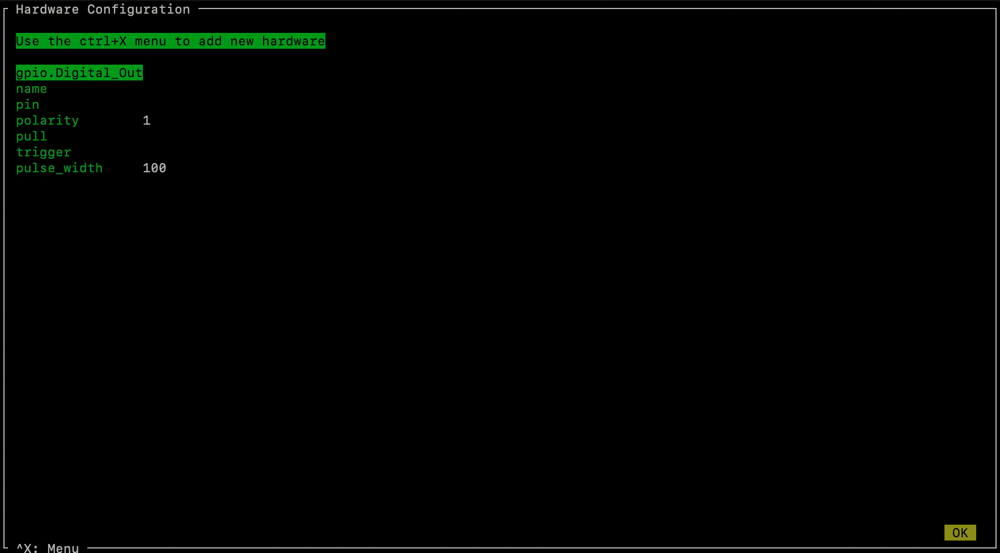

.. _installation:

Installation
************

Autopilot is able to configure your system packages and environment after installation,
but if you want to manually install system dependencies there are dependency lists near the bottom of this page.

Environment Preparation
=======================

Raspberry Pi
------------

For Pilots, we recommend starting with a fresh `Raspbian Lite <https://downloads.raspberrypi.org/raspios_lite_armhf_latest.torrent>`_ image  (see `the raspi installation documentation <https://www.raspberrypi.org/documentation/installation/installing-images/README.md>`_

Then you'll need to update and install the necessary system packages (also available as a setup script in the guided installation phase)::

    sudo apt update && sudo apt upgrade -y
    sudo apt install -y \
        python3-dev \
        python3-pip \
        git \
        libatlas-base-dev \
        libsamplerate0-dev \
        libsndfile1-dev \
        libreadline-dev \
        libasound-dev \
        i2c-tools \
        libportmidi-dev \
        liblo-dev \
        libhdf5-dev \
        libzmq-dev \
        libffi-dev

Installation with pip
=====================

If you're just taking a look at Autopilot, the easiest way to get started is to install with pip!::

    pip3 install auto-pi-lot

.. note::

    I'm just figuring out python packaging and this is a pretty complicated one to package! please `submit issues <https://github.com/wehr-lab/autopilot/issues>`_
    if the pip install isn't working!

Installation from git
=====================

If you want to start writing your own experiments and tinkering with Autopilot,
we strongly recommend forking `the repository <https://github.com/wehr-lab/autopilot/>`_
and developing directly in the library so your gorgeous insights can be integrated later.

You can work from the main branch, or you can checkout the ``dev`` branch, which is the primary development branch and
runs ahead of the main branch, but is certainly less stable and likely contains in-progress work.

 ::

    git clone https://github.com/wehr-lab/autopilot.git
    # optionally
    # git -C ./autopilot checkout dev
    pip3 install -e ./autopilot/

.. note::

    Depending on your permissions, eg. if you are not installing to a virtual environment, you may get a permissions error and need to install with the ``--user`` flag

Configuration
==============

.. note::

    If you didn't install the system dependencies yet, you can do so now with ::

        python3 -m autopilot.setup.run_script env_pilot

After installation, set Autopilot up!

The setup routine will

* install needed system packages
* prepare your operating system and environment
* set system preferences
* create a user directory (default ``~/autopilot``) to store prefs, logs, data, etc.
* create a launch script

 ::

    python3 -m autopilot.setup.setup_autopilot

Select agent
-------------
Each runtime of Autopilot is called an "Agent,"
each of which performs different roles within a system,
and thus have different requirements.

.. image:: _images/setup_agent_selection.png
    :alt: Select an autopilot agent
    :width: 100%

Select scripts
---------------

To configure the environment of your agent, autopilot can run a set of scripts (see :func:`.setup_autopilot.run_script` and :func:`.setup_autopilot.list_scripts`)

.. image:: _images/setup_scripts.png
    :alt: Select scripts to setup environment
    :width: 100%

Configure Agent
----------------

Each agent has a set of systemwide preferences stored in ``<AUTOPILOT_DIR>/prefs.json`` and accessible from :mod:`autopilot.prefs`.

.. image:: _images/setup_agent.png
    :alt: Set systemwide prefs
    :width: 100%

Configure Hardware
-------------------

If configuring a Pilot, you'll be asked to configure your hardware.

Press ``ctrl+x`` to add Hardware, and fill in the relevant parameters (most are optional and can be left blank)

Supported Systems
===================

+----------------+-----------------------------------------------+
| OS             | * Pilot: raspiOS >=Buster (lite recommended)  |
|                | * Terminal: Ubuntu >=16.04                    |
+----------------+-----------------------------------------------+
| Python Version | 3.7                                           |
+----------------+-----------------------------------------------+
| Raspberry Pi   | >=3b                                          |
+----------------+-----------------------------------------------+

Autopilot is **linux/mac** only, and supports **Python 3.7**. In particular, the Terminal was designed for Ubuntu, and the Pilot was designed for the Raspberry Pi OS.
Some parts might accidentally work in Windows but we make no guarantees.

We have tried to take care to make certain platform-specific dependencies not break the entire package,
so if you have some difficulty installing autopilot on a non-raspberry-pi linux machine please submit an issue!

