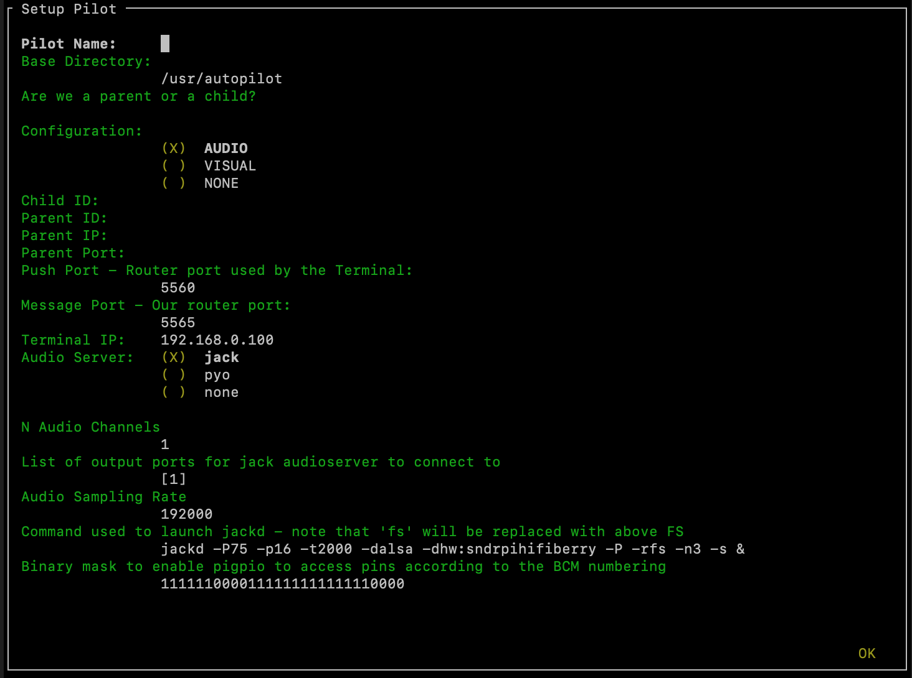
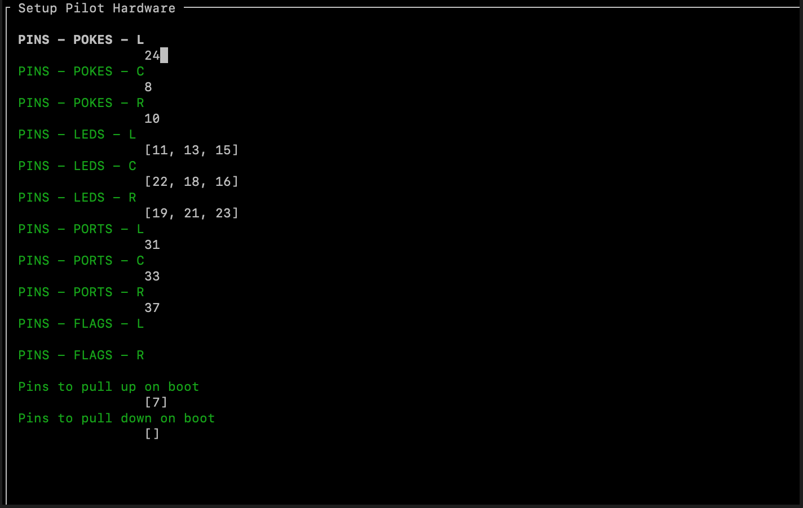

.. _setup_pilot:

Pilot Setup
************

Scripted Installation
=====================

The pilot preinstallation and setup routines are in two scripts, :ref:`presetup_pilot.sh<autopilot.setup.presetup_pilot.sh>` and :ref:`setup_pilot.py<autopilot.setup.setup_pilot.py>`.

Setting up a pilot then just requires you run those two scripts, which will prompt you as you go::

    cd <repo_directory>/autopilot/setup
    ./presetup_pilot.sh
    sudo python ./setup_pilot.py

The ``setup_pilot`` script produces the ``prefs.json`` file (see :mod:`~autopilot.prefs`) and uses `npyscreen <https://npyscreen.readthedocs.io/>`_ to enable graphical parameter setup on headless machines and over SSH. The ``prefs.json`` file can be manually edited to add any additional configuration options needed by your system.

**Basic Configuration**

* **Pilot name:** The name that will be used to address messages to the Pilot and identify it across the system. This should be unique within a swarm.
* **Base Directory:** The parent directory that will be used for all Autopilot data -- preferences files, data, logs, etc.
* **Lineage:** ("Are we a parent or a child?") - can be ``PARENT`` or ``CHILD``.
* **Configuration:** (Still experimental) Whether the Pilot has been set up for audio stimuli (and thus launches a ``jack`` server, etc.), visual stimuli (`X11` server) or neither.
* **Child/Parent Settings:** The ID of any parent or child that this pilot has. Since Autopilot's networking structure is treelike (see the whitepaper), an IP and Port are only necessary for a child that is connecting to a parent
* **Push/Message Port:** The ``push`` port is the port that messages are pushed to and should correspond to the port used by the upstream node, whether that be a Terminal or a Parent. The ``message`` port is the port opened to receive messages by the Pilot's :class:`~autopilot.core.networking.Station` object.
* **Terminal IP:** The IP address of the Terminal. Ideally the Terminal has a static, local IP address, but this can be changed at any time by editing the ``prefs.json`` file.

**Audio Configuration**

If the ``CONFIG`` is set to ``VISUAL``, these options are ignored. We will make the setup menu responsive in future versions (see :ref:`todo`).

* **Audio Server:** While both options use ``jack`` as a backend, choose between using our internal :class:`~autopilot.stim.sound.jackclient.JackClient` that dumps samples directly into Jack streams (strongly recommended) or `pyo <http://ajaxsoundstudio.com/software/pyo/>`_ which is a more flexible synthesis library but has issues with latency and reliability and will likely be deprecated in future versions
* **N Audio Channels:** How many audio channels should be used for output.
* **Output Ports:** The indices of output that should be used (depending on whether you have connected a speaker to the left or right audio out, for example)
* **Sampling Rate:** The sampling rate that will be used by the jack server.
* **Jackd String:** The string used to launch jack, see `the jackd manpage <https://linux.die.net/man/1/jackd>`_. The default configuration is:

    - **-P75** - Sets jackd to operate with a high realtime priority
    - **-p16** - Maximum number of ports (16) that the jack server can manage
    - **-t2000** - Set a 2000ms timeout before our client is kicked from jackd's client pool.
    - **-dalsa** - Use `alsa <https://www.alsa-project.org/wiki/Main_Page>`_ as the hardware backend (strongly recommended)
    - **-dhw:sndrpihifiberry** - Use the `HiFiBerry <https://www.hifiberry.com/shop/boards/hifiberry-amp2/>`_ as the output device. Customize this to your own sound card by replacing with a device listed by ``aplay -l``
    - **-P** - Playback only mode
    - **-rfs** - Sets the sampling rate, leave as "fs" to have this replaced by the sampling rate specified previously
    - **-n3** - Latency is ``--nperiods`` * ``--period`` (number of samples in a period) / ``--rate``. This sets the number of periods to 3 to make buffer underruns less likely while slightly increasing latency
    - **-s** - "Soft mode," Ignore buffer under/overruns from ALSA.

The next menu screen sets the hardware options:

These settings create a ``HARDWARE`` dictionary that maps hardware objects based on their type and name to a GPIO pin number. These names are the same as those used by tasks to parameterize hardware requirements.

The ``HARDWARE`` that are set by default are

* **POKES** - IR :class:`~autopilot.core.hardware.Beambreak` s, digital logic input
* **LEDS** - :class:`~autopilot.core.hardware.LED_RGB` s, which use 3 pins modulated by PWM to output RGB colors.
* **PORTS** - :class:`~autopilot.core.hardware.Solenoid` s, which dispense water rewards, digital logic output.
* **FLAGS** - :class:`~autopilot.core.hardware.Flag` s, which are a trivial subclass of :class:`~autopilot.core.hardware.Beambreak` with their default logic directions reversed.

Additional hardware can be configured by editing ``prefs.json``, so for example if your task calls for::

    HARDWARE = {
        'POKES':{
            'L': hardware.gpio.Digital_In
            }
        }

then one could add an entry to the ``HARDWARE`` dictionary in ``prefs.json`` like::

    "HARDWARE": {
        "POKES": {
            "L": {
                "pin": 1,
                "polarity": 1,
                "pull": 0,
                "trigger": 'U'
            }
        }
    }

(See :class:`~.gpio.Digital_In` and the metacalss :class:`~.gpio.GPIO` for parameter documentation)

.. todo::

    The ``npyscreen`` setup wizard will be extended so that hardware can be added w/ parameters graphically, see :ref:`todo`

The setup script will then create a launch script (ie. ``<BASE_DIR>/launch_pilot.sh``) and optionally install the Pilot to run as an always-on systemd service. If the Pilot is not setup as a systemd service, it needs to be started manually using the ``launch_pilot.sh`` script.

Manual Preinstall
=================

Rasbian Installation
--------------------

1. Download `Raspbian Lite <https://www.raspberrypi.org/downloads/raspbian/>`_ and unzip

    * `As a .torrent (faster, better for the soul of the universe) <https://downloads.raspberrypi.org/raspbian_lite_latest.torrent>`_
    * `Via http (slower) <https://downloads.raspberrypi.org/raspbian_lite_latest>`_

2. Use ``dd`` to write the Raspbian disk image to a microSD card. Note that ``dd`` can and will mess up your entire life if given the opportunity, be very careful that you don't run the command until you're sure your ``if=`` and ``of=`` are correct.

    * macOS::

        # get the number of the disk, should be something like /dev/disk2
        diskutil list

        # unmount the disk, using the disk # from before.
        sudo diskutil unmountDisk /dev/disk#

        # use dd to copy (use ctrl+t to check transfer status)
        # note the use of rdisk rather than disk the number should be the same
        sudo dd if=/path/to/raspbian.img of=/dev/rdisk# bs=1m

    * linux (use admin privileges when needed with ``sudo``)::

        # get the number of the disk, should be something like /dev/randomnumbersandletters
        fdisk -l

        # unmount the disk
        umount /dev/<your_disk>

        # use dd to copy (use ctrl+t to check transfer status)
        # note the use of rdisk rather than disk the number should be the same
        dd if=/path/to/raspbian.img of=/dev/<your_disk> bs=1M

3. Boot from the SD card. It should reboot once after it resizes the filesystem. Login with the default credentials:

    * username: ``pi``
    * password: ``raspberry``

4. Do an initial ``update`` and ``upgrade`` to grab any critical security fixes so we don't get sunk before we get started:

    * ``sudo apt-get update ** sudo apt-get upgrade -y``

5. **Optional:** Change the default password. You'll be sorry if you don't -- I got my credit card stolen this way.

    * ``passwd`` and follow the prompts

6. Install necessary system packages::

    sudo apt-get install -y \
        build-essential \
        cmake \
        git \
        python-pip \
        python2.7-dev \
        python3-distutils \
        libsamplerate0-dev \ # audio requirements are from here...
        libsndfile1-dev \    #
        libreadline-dev \    #
        libasound-dev \      #
        i2c-tools \          #
        libportmidi-dev \    #
        liblo-dev \          # to here.
        libhdf5-dev \
        python-numpy \       # install these python packages through apt,
        python-pandas \      # take forever to build them on the raspi
        python-tables \      # this one too
        libzmq-dev \
        libffi-dev \         # Allows us to call C functions from python
        python-cffi \
        blosc

7. And Python packages::

    sudo -H pip install -U \
        pyzmq \        # ZeroMQ wrapper
        npyscreen \    # ncurses wrapper used for setup menus
        JACK-Client \  # client for jack audio
        tornado \      # tornado message server
        inputs \       # interactions with USB devices
        blosc          # compression for networking objects

8. Autopilot depends on a modified version of `pigpio <http://abyz.me.uk/rpi/pigpio/>`_ for high performance GPIO access and control, so install it already::

    git clone https://github.com/sneakers-the-rat/pigpio.git
    cd pigpio
    make -j6
    sudo -H make install

Raspbian Performance Improvements
---------------------------------

All of these are, strictly speaking, optional, but there's not really a good reason not to do them...

#. Change the CPU Governor - Change the CPU Governor - normally the RPi keeps a low clock speed when not under load, raising it when load increases. this can cause audible glitches which are obviously to be avoided.

    * the RPi has a startup script (confusingly, /etc/init.d/raspi-config) that sets the cpu governor to on demand. disable it

        - ``sudo systemctl disable raspi-config``

    * Add a line to ``etc/rc.local``, which runs on boot, that changes the governor to "performance"

        - Either add this above 'exit 0'::

            echo "performance" | sudo tee /sys/devices/system/cpu/cpu*/cpufreq/scaling_governor

        - Or run this which does it for you::

            sudo sed -i '/^exit 0/i echo "performance" | sudo tee /sys/devices/system/cpu/cpu*/cpufreq/scaling_governor' /etc/rc.local

#. Disable Bluetooth

    * Add ``dtoverlay=pi3-disable-bt`` to ``/boot/config.txt``, or use this::

        sudo sed -i '$s/$/\ndtoverlay=pi3-disable-bt/' /boot/config.txt

    * Disable other bluetooth services::

        sudo systemctl disable hciuart.service
        sudo systemctl disable bluealsa.service
        sudo systemctl disable bluetooth.service

#.  You can decrease the memory that is allocated to the video card, but keep in mind pigpio allocates its memory from the GPU store. Don't reduce to lower than ~8MB

    * ``sudo raspi-config`` > Advanced > Memory Split

Audio Setup
-----------

Autopilot uses `Jack Audio <http://jackaudio.org/>`_ to play sounds.

#. Clone jack::

    git clone git://github.com/jackaudio/jack2 --depth 1

#. Configure, build, install::

    cd jack2
    # use ./waf --help to list compile options
    ./waf configure --alsa=yes --libdir=/usr/lib/arm-linux-gnueabihf/
    ./waf build -j6
    sudo ./waf install
    sudo ldconfig #reconfigure links

#. Give jack some more juice::

    # let jack use more memory than Raspbian wants it to
    sudo sh -c "echo @audio - memlock 256000 >> /etc/security/limits.conf"

    # let jack take a higher priority than Raspbian wants it to
    sudo sh -c "echo @audio - rtprio 75 >> /etc/security/limits.conf"

#. Install the jack python wrapper::

    sudo -H pip install JACK-Client

We also use the the `Hifiberry Amp 2 <https://www.hifiberry.com/shop/boards/hifiberry-amp2/>`_ as our soundcard and amplifier.

#. Add pi user (or whatever username you're using) to i2c group::

    sudo adduser pi i2c

#. Turn onboard audio off and enable hifiberry overlays in ``/boot/config.txt``.

    Comment out::

        # dtparam=audio=on

    Add::

        dtoverlay=hifiberry-dacplus
        dtoverlay=i2s-mmap
        dtparam=i2c1=on
        dtparam=i2c_arm=on

    Or use these commands which do it for you::

        sudo sed -i 's/^dtparam=audio=on/#dtparam=audio=on/g' /boot/config.txt
        sudo sed -i '$s/$/\ndtoverlay=hifiberry-dacplus\ndtoverlay=i2s-mmap\ndtoverlay=i2c-mmap\ndtparam=i2c1=on\ndtparam=i2c_arm=on/' /boot/config.txt

#. Edit ALSA configuration (``/etc/asound.conf``) so hifiberry is default sound card.

    Make it look like this::

        pcm.!default  {
         type hw card 0
        }
        ctl.!default {
         type hw card 0
        }

    Or use this::

        echo -e 'pcm.!default {\n type hw card 0\n}\nctl.!default {\n type hw card 0\n}' | sudo tee $ALSAFILE

#. Reboot and test with ``aplay -l`` which should look something like this::

    pi@raspberrypi:~ $ aplay -l
    **** List of PLAYBACK Hardware Devices ****
    card 0: sndrpihifiberry [snd_rpi_hifiberry_dacplus], device 0: HiFiBerry DAC+ HiFi pcm512x-hifi-0 []
      Subdevices: 1/1
      Subdevice #0: subdevice #0

Video Setup
-----------

If you're using Autopilot to present visual stimuli, it runs in an X11 instance and uses `PsychoPy <https://www.psychopy.org/>`_

#. Psychopy and X11 both have quite a few dependencies. Currently, there is no ``opencv-python`` wheel available for the raspberry pi (it can be `compiled manually <https://www.learnopencv.com/install-opencv-4-on-raspberry-pi/>`), so we have to install the psychopy dependencies piecemeal.::

    # X11 dependencies
    sudo apt-get install -y \
        xserver-xorg \             # graphics server
        xorg-dev \                 # development headers
        xinit \                    # interface for graphics server
        xserver-xorg-video-fbdev \ # frame buffer
        python-opencv \            # opencv python bindings
        mesa-utils

    # Psychopy dependencies
    pip install \
        pyopengl \
        pyglet \
        pillow \
        moviepy \
        configobj \
        json_tricks \
        arabic-reshaper \
        astunparse \
        esprima \
        freetype-py \
        gevent \
        gitpython \
        msgpack-numpy \
        msgpack-python \
        pyparallel \
        pyserial \
        python-bidi \
        python-gitlab \
        pyyaml \
        sounddevice \
        soundfile

#. Enable the Raspberry pi's OpenGL driver:

    * ``sudo raspi-config`` > advanced > GL Driver > "GL (FakeKMS)"
    * then reboot

#. Psychopy uses a few video backends, but in our experience `glfw <https://www.glfw.org/>`_ is the fastest. We have to `compile it manually <https://www.glfw.org/docs/latest/compile_guide.html>`_::

    git clone https://github.com/glfw/glfw
    cd glfw
    cmake .
    make -j7
    sudo -H make install

#. After all dependencies have been installed, install Psychopy.::

    pip install psychopy --no-deps

#. Set the default backend to glfw::

    nano ~/.psychopy3/userPrefs.cfg
    # add the line
    winType = "glfw"

Optional Installation Steps
---------------------------

sudo dpkg-reconfigure locales
sudo dpkg-reconfigure keyboard-configuration

.. todo::

    **Optional:** Setup SSH access and install RSA key

