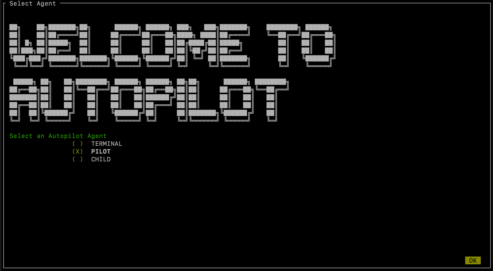
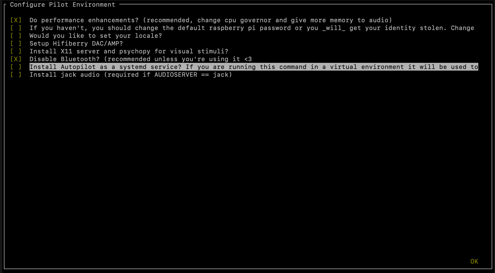
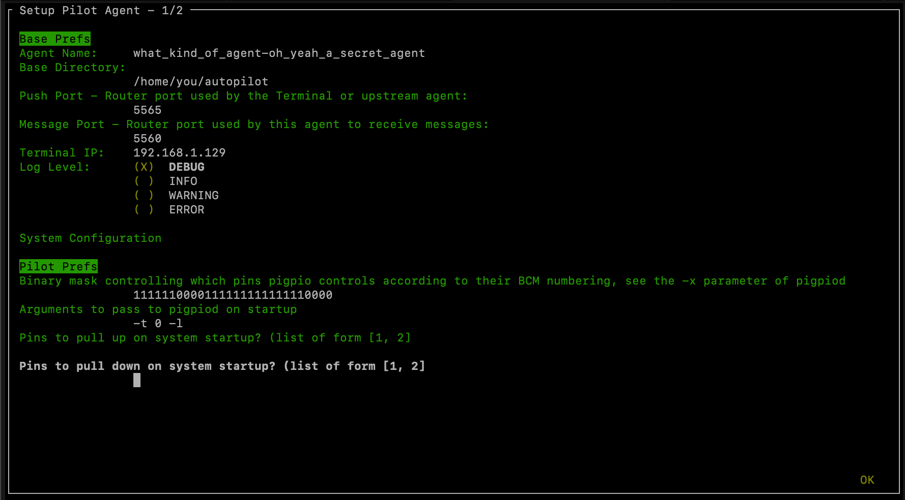

.. _installation:

Installation
************

Autopilot must be installed on the devices running the Terminal and the Pilot agents. The Pilot runs on a Raspberry Pi (remember: Pi for "Pilot") and the Terminal runs on a regular desktop computer. So Autopilot must be installed on both. This document will show you how to do that.

Supported Systems
===================

+----------------+-----------------------------------------------+
| OS             | * Pilot: raspiOS >=Buster (lite recommended)  |
|                | * Terminal: Ubuntu >=16.04                    |
+----------------+-----------------------------------------------+
| Python Version | 3.7                                           |
+----------------+-----------------------------------------------+
| Raspberry Pi   | >=3b                                          |
+----------------+-----------------------------------------------+

Autopilot is **linux/mac** only, and supports **Python 3.7**.
Some parts might accidentally work in Windows but we make no guarantees.

We have tried to take care to make certain platform-specific dependencies not break the entire package,
so if you have some difficulty installing autopilot on a non-raspberry-pi linux machine please submit an issue!

.. note::

    The latest version of raspiOS (bullseye) causes a lot of problems with the Jack audio that we have not figured out a workaround for.
    If you intend to use sound, we recommend sticking with Buster for now (available from their `legacy downloads <https://www.raspberrypi.com/software/operating-systems/#raspberry-pi-os-legacy>`_ section).

Pre-installation
=====================

On the Pilot device
-------------------

For Pilots, we recommend starting with a fresh `Raspbian Lite <https://downloads.raspberrypi.org/raspios_lite_armhf_latest.torrent>`_ image  (see `the raspi installation documentation <https://www.raspberrypi.org/documentation/installation/installing-images/README.md>`_). Note that the Lite image doesn't include a desktop environment or GUI, just a command-line interface, but that's all we need for the Pilot. It's easiest to connect a monitor and keyboard directly to the Pi while configuring it. Once it's configured, you won't need to leave the monitor and keyboard attached, and/or you can choose to connect to it with ssh.

After the Pi has been started up for the first time, run `sudo raspi-config` to do things like connect to a wifi network, set the time zone, and so on. It's very important to change the password for the `pi` user account to a new one of your choice so that you don't get hacked, especially if you're opening up ssh access.

It's also best to update the Pi's operating system at this time::

    sudo apt update
    sudo apt upgrade -y

Now install the system packages that are required by Autopilot.
You can do this by running this command, or it's also available as a setup script
in the guided installation of Autopilot. (``python -m autopilot.setup.run_script env_pilot``) ::

    sudo apt install -y \
        python3-dev \
        python3-pip \
        git \
        libatlas-base-dev \
        libsamplerate0-dev \
        libsndfile1-dev \
        libreadline-dev \
        libasound-dev \
        i2c-tools \
        libportmidi-dev \
        liblo-dev \
        libhdf5-dev \
        libzmq3-dev \
        libffi-dev

On the Terminal device
----------------------

The following system packages are required by ``PySide2`` (which no longer packages ``xcb``)::

    sudo apt-get update && \
    sudo apt-get install -y \
      libxcb-icccm4 \
      libxcb-image0 \
      libxcb-keysyms1 \
      libxcb-randr0 \
      libxcb-render-util0 \
      libxcb-xinerama0 \
      libxcb-xfixes0

Creating a Virtual Environment
------------------------------

We recommend using autopilot within a virtual environment -- we primarily develop with `virtualenv` but `conda` also appears to work.

First, install `virtualenv` (see the `virtualenv docs <https://virtualenv.pypa.io/en/latest/>`_)::

    pip3 install virtualenv

Then, create a venv. By convention, these virtual environments are stored in the directory `~/.venv`, but they can
be located anywhere.

**With `virtualenv`**::

    mkdir ~/.venv
    python3 -m virtualenv ~/.venv/autopilot

**With conda**::

    conda create --name autopilot python=3.7

The virtual environment must be "activated" now and any time you work with autopilot
(:mod:`.setup_autopilot` will detect which venv it is run from and source it in the launch script).

**With `virtualenv`**::

    source ~/.venv/autopilot/bin/activate

**With conda**::

    conda activate autopilot

Either way, you should see that the command prompt begins with the string "(autopilot)".
If you want to exit the virtual environment at any time, just type `deactivate`.

Installing Autopilot
====================
Now we're ready to install Autopilot on both the Pilot and Terminal devices. Follow the same instructions on both the Pi and the computer.

Method 1: Installation with pip
-------------------------------

If you're just taking a look at Autopilot, the easiest way to get started is to install with pip! ::

    pip3 install auto-pi-lot

Method 2: Installation from source
----------------------------------

If you want to start writing your own experiments and tinkering with Autopilot,
we strongly recommend forking `the repository <https://github.com/wehr-lab/autopilot/>`_
and developing directly in the library so your gorgeous insights can be integrated later.

Clone the repository and install an "editable" version with `-e`, this makes it so python uses the source code in your
cloned repository, rather than from the system/venv libraries.::

    git clone https://github.com/wehr-lab/autopilot.git
    cd autopilot
    pip3 install -e .

.. note::

    Depending on your permissions, eg. if you are not installing to a virtual environment, you may get a permissions error and need to install with the ``--user`` flag

.. note::

    Development work is done on the ``dev`` branch, which may have additional features/bugfixes but is much less stable!
    To use it just ``git checkout dev`` from your repository directory.

Extra Dependencies
-------------------

Different deployments depend on different packages! Eg. `Pilot`s on raspberry pis need some means of interacting with the GPIO pins, and
`Terminal`s need packages for the GUI. Rather than requiring them all for every installation, we use a set of optional dependencies.

Depending on how you intend to use it, you will likely need some additional set of packages, specified like::

    pip install auto-pi-lot[pilot]
    # or
    pip install auto-pi-lot[terminal]
    # or if using an editable install
    pip install .[pilot]

Configuration
==============

After installation, set Autopilot up! Autopilot comes with a "guided installation" process where you can select the actions you want and they will be run for you. The setup routine will:

* install needed system packages
* prepare your operating system and environment
* set system preferences
* create a user directory (default ``~/autopilot``) to store prefs, logs, data, etc.
* create a launch script

To start the guided process, run the following line. ::

    python3 -m autopilot.setup

Select agent
-------------
Each runtime of Autopilot is called an "Agent", each of which performs different roles within a system, and thus have different requirements.
If you're running the setup script on the Pi, select "Pilot". If you're running the setup script on a desktop computer, select "Terminal".
If you're configuring multiple Pis, then select "Child" on the child Pis. Then hit "OK".

You can navigate this interface with the arrow keys, tab key, and enter key.

Select scripts
---------------
Now you will see a menu of potential scripts that can be run.
Select the scripts you want to run, and then hit "OK". Note that even the simplest task ("free water") requires pigpio,
so you may want to include that one. You can see the commands that will be run in each of these scripts with :mod:`.setup.run_script`
in the :data:`.setup.scripts.SCRIPTS` dictionary.

.. note::

    Autopilot uses a slightly modified version of pigpio (https://github.com/sneakers-the-rat/pigpio) that allows it to
    get absolute timestamps (rather than system ticks) from gpio callbacks, increases the max number of scripts, etc. so
    if you have a different version of pigpio installed you will need to remove it and replace it with this one (you can
    do so with ``python -m autopilot.setup.run_script pigpiod``

Configure Agent
----------------
Each agent has a set of systemwide preferences stored in ``<AUTOPILOT_DIR>/prefs.json`` and accessible from :mod:`autopilot.prefs`.

Configure Hardware
-------------------

If configuring a Pilot, you'll be asked to configure your hardware.

Press ``ctrl+x`` to add Hardware, and fill in the relevant parameters (most are optional and can be left blank).
Consult the relevant page on the docs to see which arguments are relevant and how to use them.

.. image:: ../_images/setup_hardware.gif
    :alt: Configure Hardware
    :width: 100%

After completing this step, the file `prefs.json` will be created if necessary and populated with the information you just provided.
If it already exists, it will modified with the new information while preserving the previous preferences.

You can also manually edit the prefs.json file if you prefer.
`A template version for the Pilot is available <https://groups.google.com/g/autopilot-users/c/_MqzLDDq3CE>`_
that defines the ports, LEDs, and solenoids that are necessary for the "free water" task, which may be a useful way to get started.

Networking
==========

.. note::

    Networking is a point of major future development, particularly how agents discover one another and how ports are assigned.
    Getting networking to work is still a bit cumbersome, but you can track progress or contribute to improving networking
    at `issue #48 <https://github.com/wehr-lab/autopilot/issues/48>`_

IP Addresses
------------

Pilots connect to a terminal whose IP address is specified as ``TERMINALIP`` in ``prefs.json``

The Pilot and Terminal devices must be on the same network and capable of reaching one another. You must first figure out the IP address of each device with this command::

    ipconfig

Let's say your Terminal is at 192.168.1.42 and your Pilot is at 192.168.1.200. Replace these values with whatever you actually find using `ipconfig`.

Then, you can test that each device can see the other with ping. On the Terminal, run::

    ping 192.168.1.200

And on the Pilot, run::

    ping 192.168.1.42

If that doesn't work, there is something preventing the computers from communicating from one another, typically this is the
case if the computers are on university/etc. internet that makes it difficult for devices to connect to one another. We
recommend networking agents together using a local router or switch (though some have reported being able to
`use their smartphone's hotspot in a pinch <https://groups.google.com/g/autopilot-users/c/JvWIPpYY0TI/m/fzSBET8PAAAJ>`_ ).

Ports
-----

Agents use two prefs to configure their ports

* ``MSGPORT`` is the port that the agent receives messages on
* ``PUSHPORT`` is the port of the 'upstream' agent that it connects to.

So, if connecting a Pilot to a Terminal, the ``PUSHPORT`` of the Pilot should match the ``MSGPORT`` of the Terminal.

Ports need to be "open," but the central operation of a firewall is to "close" them. To open a port if, for example,
you are using ``ufw`` on ubuntu (replacing with whatever port you're trying to open to whatever ip address)::

    sudo ufw allow from 192.168.1.200 to any port 5560

Testing the Installation
========================

A launch script should have been created by :mod:`~autopilot.setup.setup_autopilot` at ``<AUTOPILOT_DIR>/launch_autopilot.sh`` --
this is the primary entrypoint to autopilot, as it allows certain system-level commands to precede launch (eg.
activating virtual environments, enlarging shared memory, killing conflicting processes, launching an x server, etc.).

To launch autopilot::

    ~/autopilot/launch_autopilot.sh

.. note::

    Selecting the script ``alias`` in :mod:`~autopilot.setup.setup_autopilot` allows you to call the launch script by just typing ``autopilot``

The actual launch call to autopilot resembles::

    python3 -m autopilot.core.<AGENT_NAME> -f ~/autopilot/prefs.json

