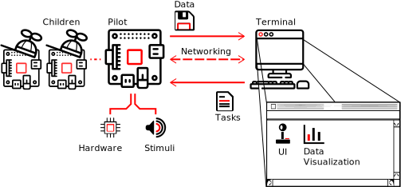
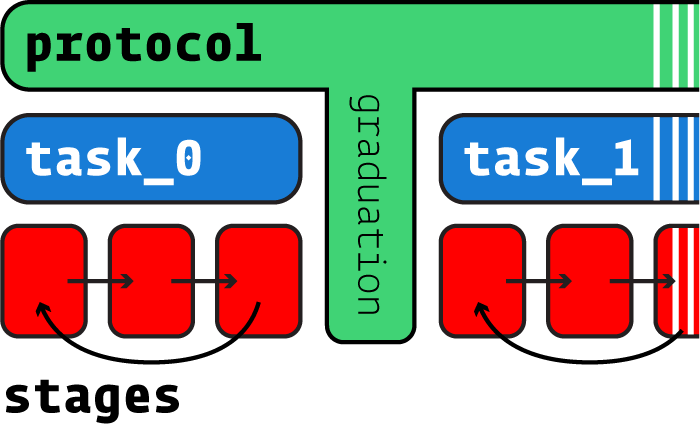

.. _overview:

.. todo::
   This page is still under construction! For a more detailed description, see the whitepaper, particularly "Program Structure"

   https://www.biorxiv.org/content/10.1101/807693v1

Overview
********

Program Structure
=================

Autopilot performs experiments by distributing them over a network of desktop computers and Raspberry Pis.
Each Computer or Pi runs an Autopilot **agent**, like the user-facing :class:`~.Terminal` or a Raspberry Pi
:class:`~.Pilot` .

The :class:`.Terminal` agent provides a :mod:`~autopilot.gui` to operate the system, manage :class:`~.subject.Subject` s and
experimental protocols, and :mod:`~.core.plots` for visualizing data from ongoing experiments.

Each :class:`.Terminal` manages a swarm of :class:`.Pilot` s that actually perform the experiments. Each :class:`.Pilot`
coordinates :mod:`.hardware` and :mod:`.stim` uli in a :class:`.Task`. :class:`.Pilot` s can, in turn, coordinate their
own swarm of networked ``Children`` that can manage additional hardware components -- allowing :class:`.Task` s to
use effectively arbitrary numbers and combinations of hardware.

Tasks
=====

Behavioral experiments in Autopilot consist of :class:`.Task` s. Tasks define the parameters, coordinate the hardware,
and perform the logic of an experiment.

Tasks may consist of one or multiple **stages**, completion of which
constitutes a **trial**. Stages are analogous to states in a finite-state machine, but don't share their limitations:
Tasks can use arbitrary transitions between stages and have computation or hardware operation persist between stages.

Multiple Tasks can be combined to make **protocols**, in which subjects move between different tasks according to
:mod:`.graduation` criteria like accuracy or number of trials. Protocols can thus be used to automate shaping routines
that introduce a subject to the experimental apparatus and task structure.

For more details on tasks, see the guide for :ref:`writing tasks <guide_task>`

Module Tour
===============================

Autopilot is intended to be used as a toolkit where you can pick and choose which parts of it you want to use for
your experiments. Most of the documentation is thus contained in the API-level documentation, though we attempt to
keep that as friendly and readable as we can.

* :class:`.Terminal` - user facing agent class used to control and configure program operation.
* :mod:`.pilot` - Experimental agent that runs tasks on Raspberry Pis
* :mod:`.data` - Data modeling, storage, and interfaces to external formats
* :mod:`~autopilot.gui` - GUI classes built with PySide2/Qt5 used by the terminal. Plots, menus, and widgets!
* :mod:`.hardware` - Hardware objects that can be used both independently and as part of Tasks
* :mod:`.networking` - Networking modules used for communication between agents, tasks, and hardware objects
* :mod:`.setup` - Setting up and configuring Autopilot and the system it runs on
* :mod:`.stim` - Stimulus generation & presentation, of which sound is currently the most heavily developed
* :mod:`.tasks` - Tasks implement experimental logic, coordinating hardware and data to perform an experiment!
* :mod:`.transform` - Composable data transformations, for analyzing or converting data on the fly for use within a task, as well as implementations of common algorithms and procedures used in experiments.
* :mod:`.utils` - Utility functions, most of which are either basic functions used everywhere, or modules that are placeholders until they can split off into their own more formal organization

  * :mod:`.utils.common` - Common operations used across multiple modules
  * :mod:`.utils.decorators` - Decorators and mixins that augment the functionality of other Autopilot Objects
  * :mod:`.utils.hydration` - Utilities for making serializable versions of autopilot objects that can be recreated in other processes/agents
  * :mod:`.utils.log_parsers` - Tools to analyze logs, load them into memory to be able to extract information for better debugging
  * :mod:`.utils.loggers` - The main logging facility used by nearly all autopilot objects to coordinate stdout and logs written to disk
  * :mod:`.utils.plugins` - Functions for loading plugins
  * :mod:`.utils.registry` - the :func:`autopilot.get` functions that return autopilot objects from both the main library and plugins
  * :mod:`.utils.wiki` - Tools to integrate the `Autopilot Wiki <https://wiki.auto-pi-lot.com>`_ with the software

.. raw:: html
   :file: ../includes/module_map.html
