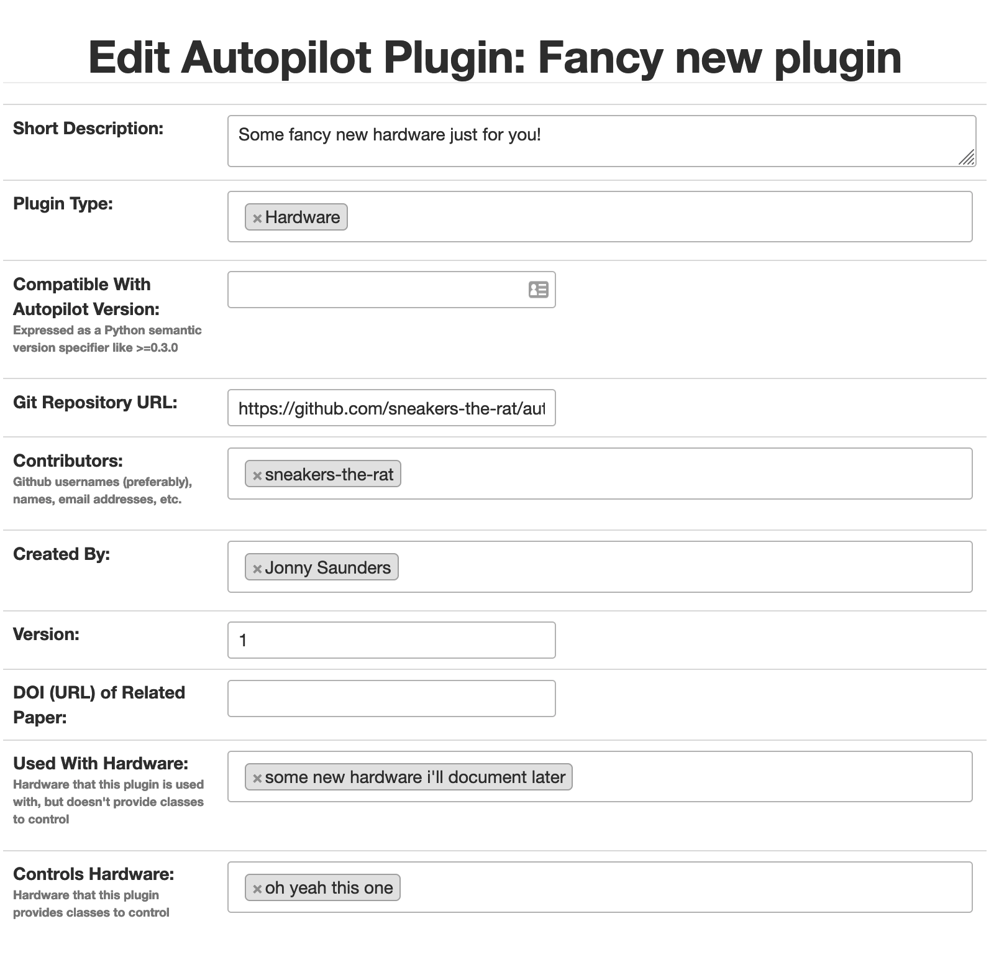
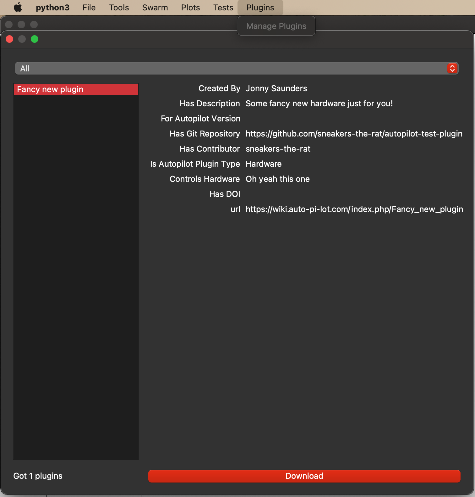

.. _guide_plugins:

Plugins & The Wiki
*********************

Autopilot is integrated with a `semantic wiki <https://www.semantic-mediawiki.org/wiki/Semantic_MediaWiki>`_, a
powerful tool that merges human-readable text with computer-readable structured information, and blurs the lines between
the two in the empowering interface of a wiki that allows anyone to edit it. The autopilot wiki is available at:

https://wiki.auto-pi-lot.com

In addition to a system for storing, discussing, and knitting together a library of technical knowledge,
the wiki is used to manage Autopilot's plugin system. The integrated plugin/wiki system is designed to

* make it easier to **extend** and hack existing autopilot classes, particularly Hardware and Task classes, without needing to
  modify any of the core library code
* make it easier to **share code** across multiple rigs-in-use by allowing you to specify the name of the plugin on the
  autopilot wiki so you don't need to manually keep the code updated on all computers it's used on
* make a gentler **scaffold between using and contributing to the library** -- by developing in a plugin folder, your
  code is likely very close, if it isn't already, ready to integrate back into the main autopilot library. In the meantime,
  anyone that is curious
* make it possible to **encode semantic metadata about the plugin** so that others can **discover, modify, and improve** on it.
  eg. your plugin might control an array of stepper motors, and from that someone can cherrypick code to run a single one,
  even if it wasn't designed to do that.
* **decentralize the development of autopilot**, allowing anyone to extend it in arbitrary ways without needing to go through
  a fork/merge process that is ultimately subject to the whims of the maintainer(s) (me 😈), or even an approval process
  to submit or categorize plugins. Autopilot seeks to be as noncoercive as possible while embracing and giving tools
  to support the heterogeneity of its use.
* make it trivial for users to not only contribute *plugins* but design new *types of plugin-like public interfaces*.
  For example, if you wanted to design an interface where users can submit the parameters they use for different tasks,
  one would only need to build the relevant semantic mediawiki template and form, and then program the API calls
  to the wiki to index them.
* ``todo`` --- fully realize the vision of decentralized development by allowing plugins to replace existing core autopilot modules...

Plugins
========

Plugins are now the recommended way to use Autopilot! They make very few assumptions about the structure of your code,
so they can be used like familiar script-based experimental tools, but they also encourage the development of modular code that
can easily be used by others and cumulatively contribute to a shared body of tools.

Using plugins is simple! Anything inside of the directory indicated by ``prefs.get('PLUGINDIR')`` is a plugin! Plugins
provide objects that inherit from Autopilot classes supported by an entry in :data:`.registry.REGISTRIES` .

For example, we want to write a task that uses some special hardware that we need. We could start by making a directory
within ``'PLUGINDIR'`` like this:

.. code-block:: text

    plugins
    ├── my-autopilot-plugin
    │   ├── README.md
    │   ├── test_hardware.py
    │   └── test_task.py

Where within ``test_hardware.py`` you define some custom hardware class that inherits from :class:`.gpio.Digital_Out` ::

    from autopilot.hardware.gpio import Digital_Out

    class Only_On_Pin(Digital_Out):
        """
        you can only turn this GPIO pin on
        """
        def __init__(self, pin, *args, **kwargs):
            super(Only_On_Pin, self).__init__(pin=pin, *args, **kwargs)
            self.set(1)

        def set(self, val):
            """override base class"""
            if val not in (1, True, 'on'):
                raise ValueError('This pin only turns on')
            else:
                super(Only_On_Pin, self).set(val)

        def release(self):
            print('I release nothing. the pin stays on.')

You can then use it in some task! Autopilot will use its registry :func:`autopilot.get` methods to find
it after importing all your plugins. For example, we can refer to it as a string in our ``HARDWARE`` dictionary in our special task::

    from datetime import datetime
    import threading
    import numpy as np
    from autopilot.tasks import Task
    from tables import IsDescription, StringCol

    class My_Task(Task):
        """
        I will personally subject myself to the labor of science and through careful hours spent meditating on an LED powered by an unsecured Raspberry Pi with the default password i will become attuned to the dance of static pixels fluctuating on the fundamentalfrequencies of ransomware and ssh bombardment to harnessthe power of both god and anime
        """

        PARAMS = {'infinite_light': {
                    'tag': 'leave the light on indefinitely? are you sure you want to leave the rest of the world behind and never cease your pursuit of this angelic orb?',
                    'type': 'bool'}}

        HARDWARE = {'esoterica': {'the_light': 'Only_On_Pin'}}

        class TrialData(IsDescription):
            ontime = StringCol(26)

        def __init__(self, infinite_light:bool=True, *args, **kwargs):
            super(My_Task, self).__init__(*args, **kwargs)
            self.init_hardware()
            self.hardware['esoterica']['the_light'].set(True)

            if not infinite_light:
                infinite_light = True
            self.infinite_light = infinite_light

            self.stages = [self.only_on]

        def only_on(self):
            self.stage_block.clear()

            if not self.infinite_light:
                threading.Timer(np.random.rand()*10e100, self.cease_your_quest).start()

            return {'ontime': datetime.now().isoformat()}

        def cease_your_quest(self):
            self.stage_block.set()
            self.hardware['esoterica']['the_light'].release()

Both your hardware object and task will be available to the rest of Autopilot, including in the GUI elements that let you
easily parameterize and assign it to your experimental subjects.

.. todo::

    We are still working on formalizing the rest of a plugin architecture, specifically dependency resolution among
    python packages, autopilot scripts, and dependencies on other plugins. All this in time! For now the wiki asks for
    a specific autopilot version that a plugin supports when they are submitted, so we will be able to track plugins
    that need to be updated for changes in the plugin API as it is developed.

Registries
==========

Plugins are supported by the functions in the :mod:`.utils.registry` module. Registries allow us to make definite but
abstract references to classes of objects that can therefore be extended with plugins.

Since for now Autopilot objects are not guaranteed to have a well-defined inheritance structure, registries are available
to the classes of objects listed in the :data:`.registry.REGISTRIES` enum. Currently they are::

    class REGISTRIES(str, Enum):
        """
        Types of registries that are currently supported,
        ie. the possible values of the first argument of :func:`.registry.get`

        Values are the names of the autopilot classes that are searched for
        inheriting classes, eg. ``HARDWARE == "autopilot.hardware.Hardware"`` for :class:`autopilot.Hardware`
        """
        HARDWARE = "autopilot.hardware.Hardware"
        TASK = "autopilot.tasks.Task"
        GRADUATION = "autopilot.tasks.graduation.Graduation"
        TRANSFORM = "autopilot.transform.transforms.Transform"
        CHILDREN = "autopilot.tasks.children.Child"
        SOUND = "autopilot.stim.sound.sounds.BASE_CLASS"

Each entry in the enum refers to the absolute package.module.class name of the topmost metaclass that is to be searched.

The :func:`autopilot.get` method first gets the base class with :func:`~.utils.common.find_class`, ensures that
plugins have been imported with :func:`~.utils.plugins.import_plugins` , and searches for a subclass with a matching name
with :func:`~.utils.common.recurse_subclasses` . If none is found in the currently imported files, it parses the `ast <https://docs.python.org/3/library/ast.html>`_
of any files below the base class in the path hierarchy. The distinction is because while we *do* assume that we can
import anything we have made/put in our plugins directory, we currently *don't* make that assumption of the
core library of autopilot -- we want to be able to offer the code for tasks and hardware that have diverse dependencies
while giving ourselves some protection against writing squirrelly edge cases everywhere.

In practice, anywhere you go to make an explicit import of an autopilot class that is suported by a registry, it is good
practice to use ``autopilot.get`` instead. It is called like::

    # autopilot.get('registry_name', 'object_name')
    # eg.
    autopilot.get('hardware', 'Digital_Out')

Note how the registry name is not case sensitive but the object name is. There are a few convenience methods/calling
patterns here too. Eg. to list all available objects in a registry::

    autopilot.get('hardware')

or to list just a list of strings instead of the objects themselves::

    autopilot.get_names('hardware')

or you can pass an object itself as the registry type in order to only find subclasses of that class::

    GPIO = autopilot.get('hardware', 'GPIO')
    autopilot.get(GPIO)

.. todo::

    In the future, we will extend registries to all autopilot objects by implementing a unitary inheritance structure.
    This will also clean up a lot of the awkward parts of the library and pave the way to rebuilding eg. the networking
    modules to be much simpler to use.

    That work will be the defining feature of v0.6.0, you can track progress and contribute by seeing the relevant
    issue: https://github.com/auto-pi-lot/autopilot/issues/31

    as well as the issues in the v0.6.0 milestone: https://github.com/auto-pi-lot/autopilot/milestone/2

The Wiki API
============

.. _guide_plugins_wiki:

The wiki's semantic information can be accessed with the functions in the :mod:`.utils.wiki` module.

Specifically, we make a function that wraps the `Semantic Mediawiki Ask API <https://www.semantic-mediawiki.org/wiki/Help:API:ask>`_
that consists of a

* **query** or a set of **filters** that select relevant pages using their **categories** and **properties**, and then
* the **properties** to retrieve from those pages.

You can see a list of the `categories <https://wiki.auto-pi-lot.com/index.php/Special:Categories>`_ and
`properties <https://wiki.auto-pi-lot.com/index.php/Special:Properties>`_ that can be used on the wiki.

For **Filters**:

* **Both** types of filters are specified with the ``[[Double Brackets]]`` of mediawiki
* **Categories** are specified with a single colon [#singlebracket]_ like ``[[Category:Hardware]]``
* **Properties** are specified with double colons, and take a property and a value like ``[[Created By::Jonny Saunders]]``

The **queried properties** are specified with a list of strings like ``['Has Datasheet', 'Has STL']``

So, for example, one could query the manufacturer, price, and url of the audio hardware documented in the wiki like::

    from autopilot.utils import wiki

    wiki.ask(
        filters=[
            "[[Category:Hardware]]",
            "[[Modality::Audio]]"
        ],
        properties=[
            "Manufactured By",
            "Has Product Page",
            "Has USD Price"
        ]
    )

which would return a list of dictionaries like::

    [{
        'Has Product Page': 'https://www.hifiberry.com/shop/boards/hifiberry-amp2/',
        'Has USD Price': 49.9,
        'Manufactured By': 'HiFiBerry',
        'name': 'HiFiBerry Amp2',
        'url': 'https://wiki.auto-pi-lot.com/index.php/HiFiBerry_Amp2'
    },
    {
        'Has Datasheet': 'https://wiki.auto-pi-lot.com/index.php/File:HiVi-RT13WE-spec-sheet.pdf',
        'Has Product Page': 'https://www.parts-express.com/HiVi-RT1.3WE-Isodynamic-Tweeter-297-421',
        'Has USD Price': 37.98,
        'Is Part Type': 'Speakers',
        'Manufactured By': 'HiVi',
        'name': 'HiVi RT1.3WE',
        'url': 'https://wiki.auto-pi-lot.com/index.php/HiVi_RT1.3WE'
    }]

These functions can be used on their own to provide interactive, programmatic access to the wiki, but maybe more importantly
it serves as a bridge between the wiki and Autopilot's software. By building API calls into the various modules of autopilot that
can query structured information from the wiki, the software can be made to take advantage of communally curated experimental
and technical knowledge.

Additionally, since it is relatively simple to create new templates and forms (see the `Page Forms <https://www.mediawiki.org/wiki/Extension:Page_Forms>`_
and `Page Schemas <https://www.mediawiki.org/wiki/Extension:Page_Schemas>`_ extensions that are used to create and
manage them)t o accept different kinds of submissions and link them to the rest of the wiki, and the plugin and
registry system allow anyone to build the classes needed to take advantage of them, it becomes possible for anyone to
create **new kinds of public knowledge interfaces to autopilot.** For example, if there was desire to share and describe parameterizations of
a particular ``Task`` along with summaries of the data, then it would be possible to make a form and template on the
wiki to accept them, and provide a GUI plugin to select *empirically optimal parameters for a given outcome measurement* ,
which would make all the *hard-won rules of thumb and superstition that guides a lot of the fine decisions in behavioral research obsolete*
*in an afternoon.*

The use of the wiki to have communal control over plugins and interfaces makes it possible for us to move
autopilot to a model of **decentralized governance** where the "official" repository becomes one version among many,
but the plugins remain integrated with the system rather than live on as unrelated forks.

Plugins on the Wiki
====================

Autopilot plugins can be found on the wiki here: https://wiki.auto-pi-lot.com/index.php/Autopilot_Plugins

*(at the moment the cupboard is relatively bare, but it always starts that way.)*

Within Autopilot, you can use the :func:`.utils.plugins.list_wiki_plugins` function to list the available functions
and return their basic metadata, which is a *very* thin wrapper around :func:`.utils.wiki.ask`

To submit new plugin, one would use the relevant form: https://wiki.auto-pi-lot.com/index.php/Form:Autopilot_Plugin

So we might submit our plugin "Fancy New Plugin" (by entering that on the form entry page), and
filling in the fields in the form as requested:

Where we provide a description and other metadata -- most important some git repository url -- that describes
the plugin. There are free text fields where appropriate, but also autocompleting token fields that let us keep some
semblance of consistency in the semantic links we create. At the end you are then given a free-text field that accepts all
common `wiki markup <https://www.mediawiki.org/wiki/Help:Formatting>`_ as well as free declaration of any semantic links that
aren't asked for in the form.

After you submit, it's immediately available in the :class:`.gui.Plugins` manager!

Each plugin has one or multiple ``Plugin Type(s)`` that corresponds to a particular entry in :class:`~.registry.REGISTRIES`
for filtering plugins that provide different types of objects.

.. todo::

    Currently the plugin manager is just a proof of concept, though it would require relatively little to add a
    routine to clone the git repo into the plugins directory, as mentioned above, we are working on integrating
    dependency management in a way that's unified throughout the package (instead of, say, needing to manually run
    ``python -m autopilot.setup.run_script picamera`` to enable the camera, objects are able to specify and
    request that their dependencies be met automatically).

    For now just ``git clone <plugin_url> ~/autopilot/plugins`` or wherever your ``PLUGINDIR`` is!

.. [#singlebracket] This is because categories are a part of mediawiki itself, but properties are implemented by semantic mediawiki. The two have slightly different meanings -- categories denote the "type of something that a page is" and properties denote "the attributes that a page has"