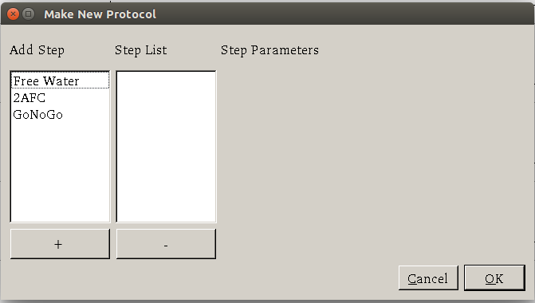
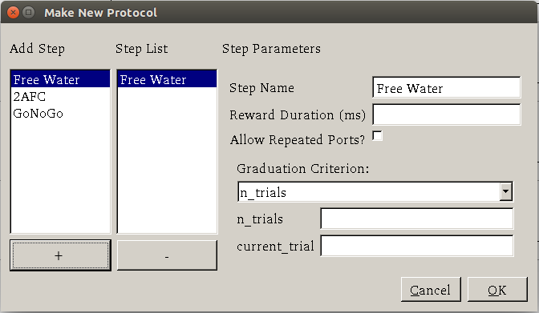
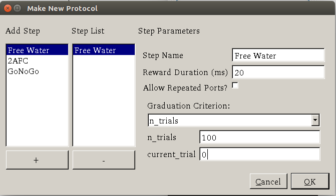
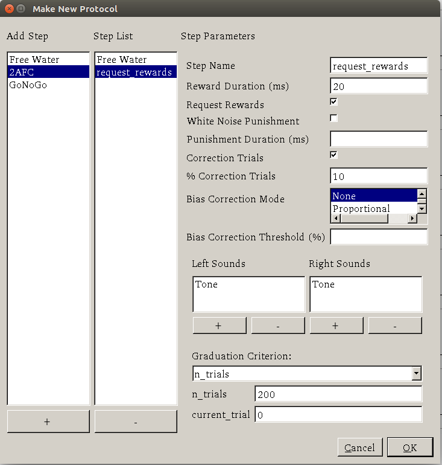
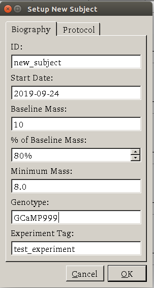
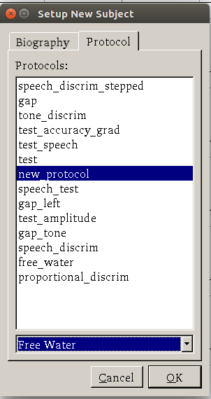
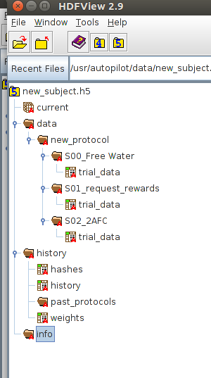

.. _training:

Training a Subject
******************

After you have set up a Terminal and a Pilot, launch the Terminal.

Connecting the Pilot
====================

If the ``TERMINAL_IP`` and port information is correctly set in the ``prefs.json`` file of the Pilot, it should automatically attempt to connect to the Terminal when it starts.
It will send a ``handshake`` message that lets the Terminal know of its existence, its IP address, and its state.
Once the Terminal receives its initial message, it will refresh, adding an entry to its ``pilot_db.json`` file and displaying a control panel for the pilot.

.. figure:: ../_images/terminal.png

If the Pilot is not automatically detected, a pilot can be manually added with its name and IP using the "New Pilot" command in the file menu.

Creating a Protocol
===================

A Protocol is one or a collection of tasks which the subject can 'graduate' through based on configurable graduation criteria.
Protocols are stored as ``.json`` files in the ``protocols`` directory within ``prefs.BASEDIR``.

Using the Protocol Wizard
-------------------------

.. warning::

    The Protocol Wizard does not currently support any Reward type except ``time``, and the stimulus specification widget is limited to specifying 'L'(eft) and 'R'(ight) sounds.
    This is related to the unification of the parameter structure in Autopilot 0.3 (see :ref:`todo`).
    Protocols can be edited after creation in the Protocol Wizard using the format examples in the manual protocol creation section below.

The Protocol Wizard allows you to build protocols using all the classes that inherit from :class:`.Task` in the Autopilot
main repository as well as any within your plugins directory.
It extracts the `PARAMS` dictionary from each task class, adds a few general parameters, and allows the user to fill them.

For this example, we will create a protocol for a freely-moving two-alternative forced choice task [#f1]_ .
This task has three 'nosepokes,' which consist of an IR break beam sensor, a solenoid, and an LED.
The subject is supposed to poke in the center port to present a stimulus and begin a trial,
and then report the identity of that stimulus category by poking in the nosepokes on either side.
If the subject is correct, they are rewarded with water.

It is relatively challenging for an animal subject to learn this task without having a few beginning shaping steps that introduce it to the nature of the arena and the structure of the task.
In this example we will program a three-step shaping regimen:

* **Step 1 - Free Water:**  The subject will be rewarded for merely poking the IR sensor in order to let them know that in this universe water comes out of these particular holes in the wall
* **Step 2 - Request Rewards:** The task will operate as normal (stimuli are presented, etc.), but the subject will be rewarded for the initial center-poke as well as for a correct answer. This teaches them the temporal structure of the task -- center first, then side ports.
* **Step 3 - Frequency Discrimination:** The final step of the protocol, the mouse is taught to respond left to a low-frequency tone and right to a high-frequency tone.

1. To start, select ``New Protocol`` from the 'file' menu.

2. Add a step from the list of tasks in the leftmost column by selecting it and pressing the '+' button. Here we are adding the Free Water step.

3. Specify the parameters for the task in the rightmost window -- we give 20ms of water every time the subject poke, etc.

4. Add the second "Request Rewards" step, the remaining options that are configured are:
* list
* of
* options

5. Press ok, save and name the protocol file.

6. That leaves us with a protocol file:

.. code-block:: json

    [
        {
            "allow_repeat": false,
            "graduation": {
                "type": "n_trials",
                "value": {
                    "current_trial": "0",
                    "n_trials": "100",
                    "type": "n_trials"
                }
            },
            "reward": "20",
            "step_name": "Free Water",
            "task_type": "Free Water"
        },
        {
            "bias_mode": 0,
            "correction": true,
            "correction_pct": "10",
            "graduation": {
                "type": "n_trials",
                "value": {
                    "current_trial": "0",
                    "n_trials": "200",
                    "type": "n_trials"
                }
            },
            "punish_stim": false,
            "req_reward": true,
            "reward": "20",
            "step_name": "request_rewards",
            "stim": {
                "sounds": {
                    "L": [
                        {
                            "amplitude": "0.01",
                            "duration": "100",
                            "frequency": "4000",
                            "type": "Tone"
                        }
                    ],
                    "R": [
                        {
                            "amplitude": "0.01",
                            "duration": "100",
                            "frequency": "10000",
                            "type": "Tone"
                        }
                    ]
                },
                "tag": "Sounds",
                "type": "sounds"
            },
            "task_type": "2AFC"
        },
        {
            "bias_mode": 0,
            "correction": true,
            "correction_pct": "10",
            "graduation": {
                "type": "accuracy",
                "value": {
                    "threshold": "80",
                    "type": "accuracy",
                    "window": "1000"
                }
            },
            "punish_stim": false,
            "req_reward": false,
            "reward": "20",
            "step_name": "2AFC",
            "stim": {
                "sounds": {
                    "L": [
                        {
                            "amplitude": "0.01",
                            "duration": "25",
                            "frequency": "100",
                            "type": "Tone"
                        }
                    ],
                    "R": [
                        {
                            "amplitude": "0.01",
                            "duration": "100",
                            "frequency": "100",
                            "type": "Tone"
                        }
                    ]
                },
                "tag": "Sounds",
                "type": "sounds"
            },
            "task_type": "2AFC"
        }
    ]

Manual Protocol Creation
------------------------

Protocols can be created manually by...

1. Extracting the task specific parameters, eg::

    params = autopilot.tasks.Nafc.PARAMS
    # for example...
    params['param_1'] = value_1

2. Adding general task parameters ``stim``, ``reward``, ``graduation``, ``step_name``, and ``task_type``.
These are just examples, the ``stim`` and ``reward`` fields can be any parameters consumed by a :class:`~autopilot.stim.managers.Reward_Manager` or :class:`~autopilot.stim.managers.Stimulus_Manager`.
The ``graduation`` field can be any parameters consumed by a :class:`~autopilot.tasks.graduation.Graduation` object. The ``step_name`` and ``task_type`` need to be strings, the ``task_type`` corresponding to a key in the :data:`~autopilot.tasks.TASK_LIST`.::

    params.update({
        'stim': {
            'type': 'sounds',
            'sounds': {
                'L':[...],
                'R':[...]
            }
        },
        'reward': {
            'type': 'volume',
            'value': 2.5
        },
        'graduation': {
            'type': 'accuracy',
            'value': {
                'threshold': 0.8,
                'window': 1000
            }
        },
        'step_name': 'cool_new_step',
        'task_type': 'NAFC'
    })

An example for our speech task can be found in :mod:`autopilot.tasks.protocol_scripts`.

Creating a Subject
==================

A :class:`~autopilot.data.subject.Subject` stores the data, protocol, and history of a subject.
Each subject is implicitly assigned to a Pilot by virtue of the structure of the ``pilot_db.json`` file, but they can be switched by editing that file.

1. Create a subject by clicking the ``+`` button in the control panel of a particular Pilot

2. Fill out the basic biographical information

3. Assign the subject to a protocol and step. Notice how the task we created earlier is here!

By creating one, we create an HDF5 file that stores a serialized version of the ``.json`` protocol file that was generated above,
as well as the basic directory and table structure to enable the subject to store data from running the task.

Running the Task
================

1. Select the subject's name and press the start button! The Terminal will send a ``START`` message to the Pilot that includes the parameter dictionary for the current step, and if the Pilot is configured with the hardware required in the ``HARDWARE`` dictionary of the task, it should run.

2. The Terminal will initialize the Pilot's plot using the parameters in the task's ``PLOT`` dictionary and display data as it is received.

Debugging a Task
================

If a Pilot doesn't start the task appropriately, if you have installed the Pilot as a system daemon you can retrieve the logs and see the stack trace by accessing the pilot via SSH::

    ssh pi@your.pi.ip.address

.. note::

    Because Raspberry Pis are common prey on the internet, we strongly advise changing the default password, installing RSA keys to access the pi, and disabling password access via SSH.

and then printing the end of the logs with ``journalctl``::

    # print the -end of the logs for system -unit autopilot
    journalctl -u autopilot -e

.. [#f1] Yes we are aware that the "two-alternative forced choice" task described here is actually maybe called a "yes-no task" because there is only one stimulus presented at a time. The literature appears stuck with this term, however.

